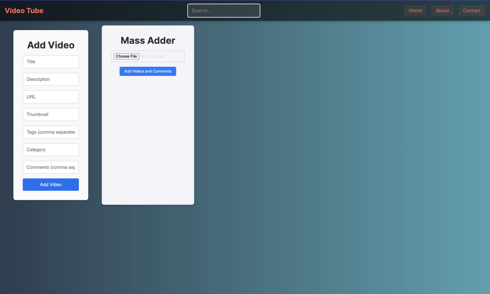
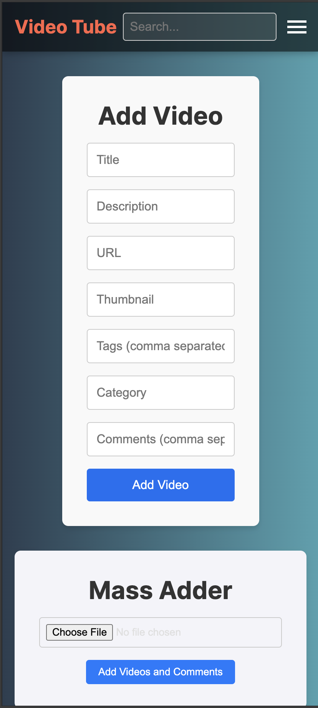

# Next Tube

Welcome to **Next Tube**, a fully-fledged video platform built with the latest version of Next.js (14). This project demonstrates cutting-edge features, optimal performance, and a seamless user experience. Whether you're a recruiter, a developer, or an enthusiast, you're about to witness the power and elegance of modern web development.

## Features

- **Blazing Fast Performance**: Leveraging Next.js's SSR and ISR capabilities for optimal load times.
- **Infinite Scrolling**: Smooth and efficient infinite scrolling for a seamless user experience.
- **SEO Optimized**: Comprehensive SEO practices implemented for superior search engine ranking.
- **Mass Generator**: Create thousands of videos with full SEO components from single .txt file.
- **Responsive Design**: Fully responsive and mobile-friendly layout.
- **Admin Panel**: Robust admin panel for managing video content.
- **Dynamic Routing**: Clean and efficient dynamic routing with slugs.
- **Video Management**: Comprehensive video management system including titles, descriptions, categories, tags, and comments.
- **Real-time Updates**: Automatic updates and data fetching using Next.js features.
- **Efficient Client/Server Components**: Optimized client/server component architecture for improved performance and scalability.


## Tech Stack

- **Framework**: Next.js 14
- **Database**: MongoDB
- **Styling**: CSS Modules, Tailwind CSS
- **Deployment**: Vercel or anywhere really

## Screenshots

### Desktop




### Mobile




## Getting Started

Follow these instructions to get a copy of the project up and running on your local machine.

### Prerequisites

- Node.js
- MongoDB

### Installation

1. Clone the repo
   ```sh
   git clone https://github.com/your-username/next-tube.git
   ```

## Contributing

Contributions are what make the open-source community such an amazing place to be, learn, inspire, and create. Any contributions you make are **greatly appreciated**.

1. Fork the Project
2. Create your Feature Branch (`git checkout -b feature/AmazingFeature`)
3. Commit your Changes (`git commit -m 'Add some AmazingFeature'`)
4. Push to the Branch (`git push origin feature/AmazingFeature`)
5. Open a Pull Request

## License

Distributed under the MIT License. See `LICENSE` for more information.

## Contact

Umut Piynar - [@uruskan.](https://discordapp.com/users/411884711057817600) - auruskan@outlook.com

Project Link: [https://github.com/uruskan/next-tube](https://github.com/uruskan/next-tube)

## Acknowledgments

- [Next.js](https://nextjs.org/)
- [MongoDB](https://www.mongodb.com/)
- [Vercel](https://vercel.com/)
- [OpenAI](https://openai.com/)
- [Unsplash](https://unsplash.com/) for placeholder images
- Special thanks to all contributors and supporters of this project.

---

