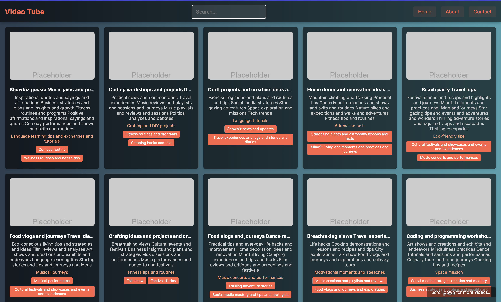
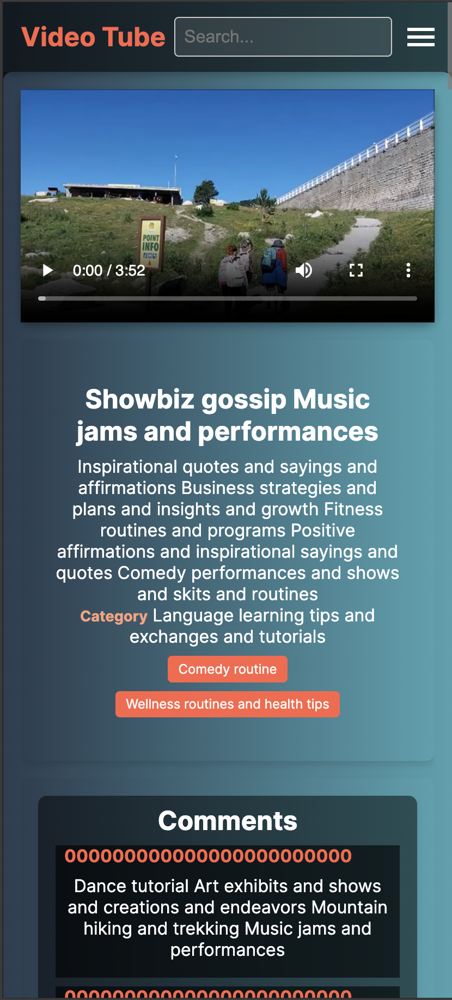

# Next Tube

Welcome to **Next Tube**, a fully-fledged video platform built with the latest version of Next.js (14). This project demonstrates cutting-edge features, optimal performance, and a seamless user experience. Whether you're a recruiter, a developer, or an enthusiast, you're about to witness the power and elegance of modern web development.

## Features

- **Next.js 14 with App Router**: Utilizes the latest Next.js features, ensuring a blazing fast and SEO-friendly experience.
- **Dynamic Video Content**: Fetches and displays videos with infinite scrolling, ensuring smooth and uninterrupted user engagement.
- **Responsive Design**: Fully optimized for both desktop and mobile devices.
- **SEO Optimized**: Comprehensive SEO implementation to enhance discoverability and ranking.
- **Admin Dashboard**: A robust admin page for managing videos and comments efficiently.
- **Mass Video and Comment Adder**: Upload large datasets of videos and comments effortlessly.
- **Modern UI**: Elegant and intuitive user interface with themes, gradients, and shadows.

## Screenshots

### Desktop




### Mobile




## Tech Stack

- **Framework**: Next.js 14
- **Database**: MongoDB
- **Styling**: CSS Modules, Tailwind CSS
- **Deployment**: Vercel

## Getting Started

Follow these instructions to get a copy of the project up and running on your local machine.

### Prerequisites

- Node.js
- MongoDB

### Installation

1. Clone the repo
   ```sh
   git clone https://github.com/your-username/next-tube.git
